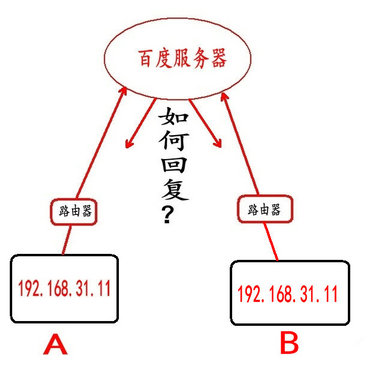

# p2p知识

## 关键词

NAT traversal NAT穿透
hole punching UDP打洞技术
uPNP 
Internet Gateway Device IGD

## nat
网络地址转换（Network Address Translation，简称NAT）是一种在IP分组通过路由器或防火墙时重写源IP地址或/和目的IP地址的技术。这种技术被普遍使用在有多台主机但只通过一个公有IP地址访问因特网的私有网络中。20世纪90年代中期，NAT是作为一种解决IPv4地址短缺以避免保留IP地址困难的方案而流行起来的。家庭和小型办公室的路由器一般都集成了防火墙，DHCP服务器和NAT功能。

NAT穿越是广泛用于P2P领域的通信方式。在视频会议过程中，NAT穿越也在内外网消息通信中起到了至关重要的作用，平台服务器之间、与会终端之间、以及平台服务器和与会终端之间都可能存在信令或多媒体流等的NAT穿越。
### NAT的类型
NAT有4种不同的类型：Full Cone、Address Restricted Cone、Port Restricted Cone和Symmetric（对称形），其中Full Cone、Address Restricted Cone、Port Restricted Cone等3种类型又统称为Cone NAT（圆锥形NAT）。

### 端口映射

对于初学者而已，我们学习的网络编程(如TCP,UDP编程)，我们通常都是在局域网内进行通信测试，有时候我们或者会想，我们现在写的内网网络数据和外网的网络数据有什么不同，我们内网的数据是如何走出外网的呢?

　　再者，我们大多人都是使用宽带上网，结果发现，A 和 B 的局域网 IP 都是192.168.31.11,当他们都访问百度浏览网页时，百度服务器回复数据时，如何区分是给 A 还是给 B 呢?

#### 公有 IP 和私有 IP 的区别

首先，我们需要了解一下什么是公有 IP 和私有 IP ?

公有地址(Public address)：由 Inter NIC(Internet Network Information Center 因特网信息中心)负责。这些 IP 地址分配给注册并向Inter NIC提出申请的组织机构，公有 IP 全球唯一，通过它直接访问因特网(直接能上网)。

私有地址(Private address)：属于非注册地址，专门为组织机构内部使用，说白了，私有 IP 不能直接上网。

而我们平时通过运营商(电信、移动、联通宽带等)上网，家里面通过路由器分出来的 IP 都是私有 IP(局域网 IP)，大家可能会疑问，我们可以上网啊，怎么会是私有 IP 呢?租用(申请)公有 IP 是需要钱的。 运营商买了一些公有 IP，然后通过这些公有 IP 分出来，再分给一个一个的用户使用。这个过程有点类似于，我们去安装了宽度，通过路由器分出几个 IP，让好几个人都能上网，当然运营商通过公有 IP 分出来的过程肯定比这个复杂多了。所以，我们平时上网用的 IP 是私有 IP，真正拥有公有 IP 的是运营商(当然，我们可以租用一个公有 IP )。所以，A 家庭的局域网 IP 和 B 家庭的局域网 IP 相同很正常，但是，最终 A 和 B 能上网(数据走出去)还是通过运营商的公有 IP，毕竟，公有 IP 的资源有限，这一片区域的用户使用的很有可能(实际上就是这样的)是同一个公有 IP，这样的话，又回到前面的问题，假如 A 和 B 的局域网 IP 相同(192.168.31.11)，当他们同时访问百度服务器的时候，百度服务器如何区分哪个是 A，哪个是 B 呢?

- 端口映射（Port Mapping）：如果你是ADSL、MODEM或光纤等宽带接入用户，想在公司或网吧内部建一个服务器或WEB站点，并且想让互联网上的用户访问你的服务器，那么你就会遇到端口映射问题。通常情况下，路由器都有防火墙功能，互联网用户只能访问到你的路由器WAN口(接ADSL的电话线口或路由宽带外网口)，而访问不到内部服务器。要想让互联网用户访问到你建的服务器，就要在路由器上做一个转发设置，也就是端口映射设置，让互联网用户发送的请求到达路由器后,再转发到你建立的服务器或WEB站点。这就是端口映射。由于各个路由器厂商所取功能名称不一样，有的叫虚拟服务器，有的叫NAT设置端口映射。在路由器上的端口映射表中添加在局域网中本地服务器的ip地址+tcp端口.设置完成后,用户就跳过路由器防火墙访问你的路由器.

- 动态端口映射:内网中的一台电脑要访问新浪网，会向NAT网关发送数据包，包头中包括对方(就是新浪网)IP、端口和本机IP、端口，NAT网关会把本机IP、端口替换成自己的公网IP、一个未使用的端口，并且会记下这个映射关系，为以后转发数据包使用。然后再把数据发给新浪网，新浪网收到数据后做出反应，发送数据到NAT网关的那个未使用的端口，然后NAT网关将数据转发给内网中的那台电脑，实现内网和公网的通讯.当连接关闭时，NAT网关会释放分配给这条连接的端口，以便以后的连接可以继续使用。动态端口映射其实也就是NAT网关的工作方式。

- 静态端口映射: 就是在NAT网关上开放一个固定的端口，然后设定此端口收到的数据要转发给内网哪个IP和端口，不管有没有连接，这个映射关系都会一直存在。就可以让公网主动访问内网的一个电脑。

## NAT内网穿透

局域网中的主机IP与公网IP建立P2P连接的解决方案是做NAT穿透。
比特币和以太坊均使用了 UPnP （Universal Plug and Play）协议作为局域网穿透工具，只要局域网中的路由设备支持 NAT 网关功能、支持 UPnP 协议，即可将你的区块链节点自动映射到公网上。

UPnP 是通用即插即用（Universal Plug and Play）的缩写，它主要用于设备的智能互联互通，所有在网络上的设备马上就能知道有新设备加入。

## NAT端口映射: napt,upnp以及nat-pmp
natp是内部机器通过路由器也就是网关向外部发送网络请求时，路由器记住内部机器的ip和端口，同时跟真正发送数据的外网端口绑定，产生一个临时映射表，当收到外网数据以后通过这个映射表将数据转发给内部机器。nat的多种映射类型以后再说。

upnp和nat-pmp差不多，就是在路由器和内部机器提供一个中间服务，内部机器请求upnp将其使用到的端口跟某个外网端口绑定，这样当路由器收到外网请求时先去upnp里查找是否此外网端口已经被upnp映射，如果被映射则将数据转发到内部机器对应的端口。

napt是路由器肯定带的功能，其产生的nat映射表有多种类型，但都有时效，也就是超过一段时间原来的nat映射就无效，然后新建新的nat映射。nat映射必须先由内部机器向外部网络发起请求才会产生。

upnp是把映射关系长期保存下来，外部机器可以主动向内部机器请求网络连接。 所以首先要路由器开启upnp功能（一般由用户去路由器设置里手动开启upnp），然后内部机器的程序要自己实现upnp客户端功能：主动查找upnp服务，主动增加映射、删除映射等。

客户端无法控制natp的映射，可以主动控制upnp映射。
————————————————
版权声明：本文为CSDN博主「云卷云舒么么哒」的原创文章，遵循 CC 4.0 BY-SA 版权协议，转载请附上原文出处链接及本声明。
原文链接：https://blog.csdn.net/gamereborn/article/details/80200412